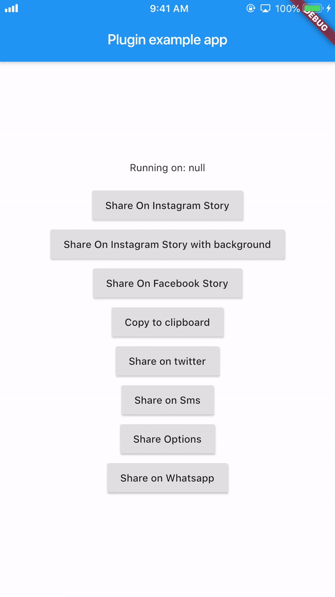
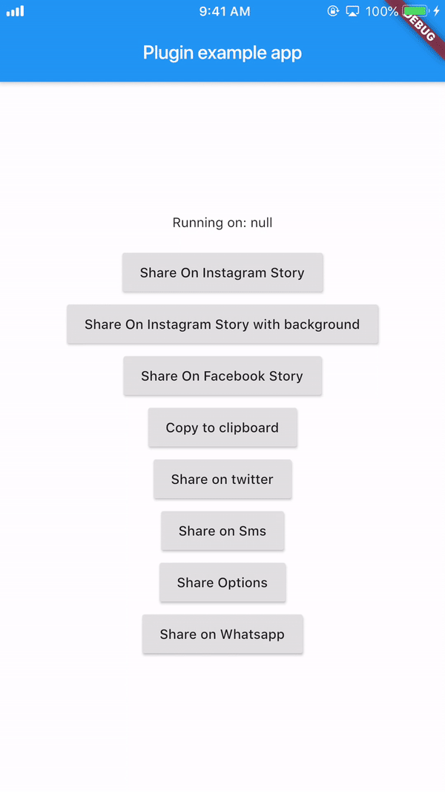

# social_share

Wide variety of sharing options you'll need to share directly to certain popular apps or just share with default native share.

## Introduction

Works on both platforms `Android` and `iOS`

It provides you with most of the popular sharing options
With this plugin you can share on instagram stories and facebook stories and also copy to clipboard

## Usage

### Android Configuration

#### Paste the following attribute in the `manifest` tag in the `android/app/src/main/AndroidManifest.xml`:

```
 		`xmlns:tools="http://schemas.android.com/tools"`
```

##### For example:

```
        <manifest xmlns:android="http://schemas.android.com/apk/res/android"
                xmlns:tools="http://schemas.android.com/tools"
                package="your package...">
```

#### Add this piece of code in the `manifest/application` in the `android/app/src/main/AndroidManifest.xml`:

```
 		<provider
            android:name="androidx.core.content.FileProvider"
            android:authorities="${applicationId}.com.shekarmudaliyar.social_share"
            android:exported="false"
            android:grantUriPermissions="true"
            tools:replace="android:authorities">
            <meta-data
                android:name="android.support.FILE_PROVIDER_PATHS"
                android:resource="@xml/filepaths" />
        </provider>
```

#### Create a xml file named `filepaths.xml` in the `app/src/main/res/xml` folder and paste this code in the file :

```
<?xml version="1.0" encoding="utf-8"?>
<paths xmlns:android="http://schemas.android.com/apk/res/android">
    <cache-path name="image" path="/"/>
</paths>
```

### iOS Configuration

#### Add this to your `Info.plist` to use share on instagram and facebook story

```
<key>LSApplicationQueriesSchemes</key>
	<array>
	<string>instagram-stories</string>
	<string>facebook-stories</string>
	<string>facebook</string>
	<string>instagram</string>
	<string>twitter</string>
	<string>whatsapp</string>
    <string>tg</string>
	</array>
```

### Add this if you are using share on facebook. For this you have to create an app on https://developers.facebook.com/ and get the App ID

```
<key>FacebookAppID</key>
<string>xxxxxxxxxxxxxxx</string>
```

#### shareInstagramStory

```
SocialShare.shareInstagramStory(imageFile.path, "#ffffff",
                              "#000000", "https://deep-link-url");
```

#### shareFacebookStory

For iOS

```
SocialShare.shareFacebookStory(image.path,"#ffffff","#000000",
                              "https://deep-link-url","facebook-app-id");
```

For Android
appID is mandatory if using shareFacebookStory or else it wont work

```
SocialShare.shareFacebookStory(image.path,"#ffffff","#000000",
                              "https://deep-link-url","facebook-app-id",
							  appId: "xxxxxxxxxxxxx");
```

#### copyToClipboard

```
SocialShare.copyToClipboard("This is Social Share plugin");
```

#### shareTwitter

```
//without hashtags
SocialShare.shareTwitter("This is Social Share plugin");

//with hashtags
SocialShare.shareTwitter(
                              "This is Social Share twitter example",
                              hashtags: ["hello", "world", "foo", "bar"]);

//with hashtags and link
SocialShare.shareTwitter(
                              "This is Social Share twitter example",
                              hashtags: ["hello", "world", "foo", "bar"],url:"https://your-url-here/");
```

#### shareSms

```
//without url link in message
SocialShare.shareSms("This is Social Share Sms example");

//with url link in message
SocialShare.shareSms("This is Social Share Sms example",url: "https://your-url-here/");
```

#### shareWhatsapp

```
SocialShare.shareWhatsapp("Hello World");
```

#### shareTelegram

```
SocialShare.shareTelegram("Hello World");
```

#### shareOptions

This will open the default native share options

```
//without an image
SocialShare.shareOptions("Hello world");

//with an image
SocialShare.shareOptions("Hello world",imagePath: image.path);
```

#### checkInstalledAppsForShare

```
SocialShare.checkInstalledAppsForShare();
```

# Here's few demo!

## Story share on Instagram



## Story share on Facebook



## Copy to Clipboard


# Known issues

On Android 6, Share to Instagram Stories may not open Instagram app or load the specified image.

# Buy me a :coffee: !!

((More coffee == more code) == faster updates)

[](https://paypal.me/b1naryishere/10)
